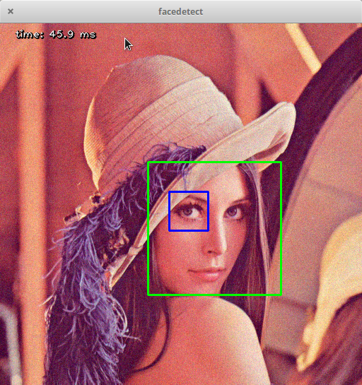
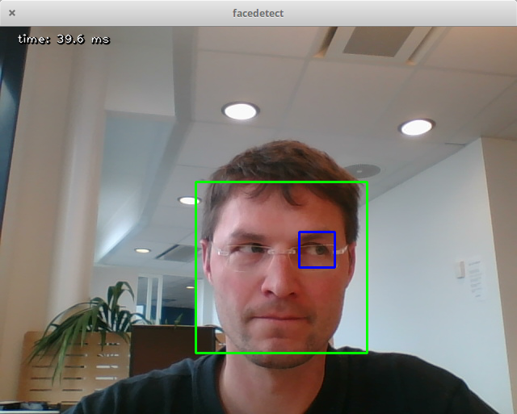

# Face Detection using Microsoft Face API

This demo uses OpenCV and Microsoft Face API to detect, classify faces in an image, and possibily to recognize the persons.
The puzzle is assembled live... stay tuned!

* https://docs.microsoft.com/en-us/azure/cognitive-services/face/face-api-how-to-topics/howtoidentifyfacesinimage
* https://westus.dev.cognitive.microsoft.com/docs/services/563879b61984550e40cbbe8d/operations/563879b61984550f30395236

<table border = 0 bordercolor = black align = center>
<tr>
<th></img></th>
<th></img></th>
</tr>
</table>


I had to play a bit with OpenCV to track the face in a live video feed so that it looks a  bit more interactive, but the Microsoft Face API should not be called at every frame simply for a matter of cost.

Various tests:

* OpenCV face (and eyes detection) tracking from your laptop's camera stream:

```python
python ./test_openCV/face_eyes_detection/OpenCV2_Face_Detection.py
```

* same code, but for some reason in a notebook, the video capture falls back to Lena's picture with random noise changing over time: open this notebook `./test_openCV/face_eyes_detection/OpenCV2 Face Detection Lena+noise.ipynb`

* Strangely this little piece of OpenCV code works fine opening your laptop's camera feed in a notebook:

```python
import numpy as np
import cv2

cap = cv2.VideoCapture(0)
#set the width and height, and UNSUCCESSFULLY set the exposure time
cap.set(3,1080)
cap.set(4,1024)
cap.set(15, 0.1)

while True:
    ret, img = cap.read()
    cv2.imshow("input",img)
    key = cv2.waitKey(10)
    if key == 27:
        break


cv2.destroyAllWindows() 
cv2.VideoCapture(0).release()
```

* OK, now this one succeeds to detect and track a face from within the notebook:

open this notebook `./test_openCV/face_eyes_detection/OpenCV_Face_Tracking_in_Notebook.ipynb`
